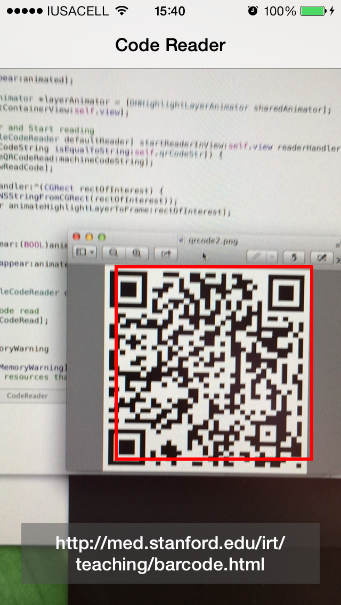

#Robocop

The fairest, smartest and easiest way to read all kinds of AVMetadataObjectType objects like EAN13, QR Code, Aztec Codes and even **face detection**, among others barcodes with just **one method call** for iOS 7+ devices.

By default, Robocop is setup to read QR codes out-of-the-box.

##Installation

1. The preferred way of installation is via [Cocoapods](http://cocoapods.org). Just add 

```ruby
pod 'Robocop'
```

to your Podfile and run `pod install`. It will install the most recent version of Robocop.

Alternatively you could copy all the files in the ```Classes/``` directory into your project. Be sure 'Copy items to destination group's folder' is checked.

##Best Features
###Blocks!!
####Code Reader Handler
```objective-c
typedef void (^RobocopCodeReaderHandler)(NSString *machineCodeString);
```
You get this callback along with the string representation of the read code.

####Rect of Interest Handler
```objective-c
typedef void (^RobocopRectOfInterestHandler)(CGRect rectOfInterest);
```
You get this callback with the ```CGRect``` representing the bounding rectangle of the object with respect to the picture in which the barcode/face resides.

##Basic Usage

1. Import the header: ```#import "Robocop.h"```
2. Setup QR Reader and Start reading:

```objective-c
[[Robocop sharedInstance]
        startReadingInView:self.view 
        readerHandler:^(NSString *machineCodeString) {
            NSLog(@"Code: %@", machineCodeString);
        } rectOfInterestHandler:^(CGRect rectOfInterest) {
            // The rect for the barcode being read
            // See code example to know how to add a highlight layer using this rect on top of your preview
            NSLog(@"%@", NSStringFromCGRect(rectOfInterest));
        }];
```

3. That's all!  

##Screenshots

Simple usage:


##Available Methods
###How to read other kinds of machine codes (including face detection)

```objective-c
- (void)startReadingMachineReadableCodeObjects:(NSArray *)codeObjects
                                        inView:(UIView *)preview
                                        readerHandler:(DHCodeReaderHandler)readerHandler
                                        rectOfInterestHandler:(DHReaderRectOfInterestHandler)rectOfIntesetHandler;
```

Use this method to pass an array containing the AVMetadataObjectType objects that you want the reader to be able to distinguish.

For example:
```objective-c
NSArray *codeTypes = @[AVMetadataObjectTypeFace, AVMetadataObjectTypeEAN13Code, AVMetadataObjectTypeQRCode];
```

And here is how you use the method with the array above mentioned:

```objective-c
[[Robocop sharedInstance]
     startReadingMachineReadableCodeObjects:codeTypes
	 inView:self.view
	 readerHandler:^(NSString *machineCodeString) {
		 NSLog(@"Code: %@", machineCodeString);
	} rectOfInterestHandler:^(CGRect rectOfInterest) {
		NSLog(@"%@", NSStringFromCGRect(rectOfInterest));
	}];
```
All the code types that you can read are declared on ```AVFoundation/AVMetadataObject.h```

### How to read all available kind of codes (shortcut)
If you want to detect **all kind of codes** just pass ***nil*** to the method above for the codeObjects array.
```objective-c
[[Robocop sharedInstance]
     startReadingMachineReadableCodeObjects:nil
     inView:self.view
	 readerHandler:^(NSString *machineCodeString) {
		 NSLog(@"Code: %@", machineCodeString);
	} rectOfInterestHandler:^(CGRect rectOfInterest) {
		NSLog(@"%@", NSStringFromCGRect(rectOfInterest));
	}];
```

### How to stop the reader
```objective-c
- (void)stop;
```
Simple enough, isn't it?

##Contribution

Of course, please send a pull-request and/or raise an issue. It is always good to know how to make things better, yay!


##Author

David Hernandez ([dav.viidd94@gmail.com](mailto:dav.viidd94@gmail.com))


##License

Robocop is under the MIT License.

